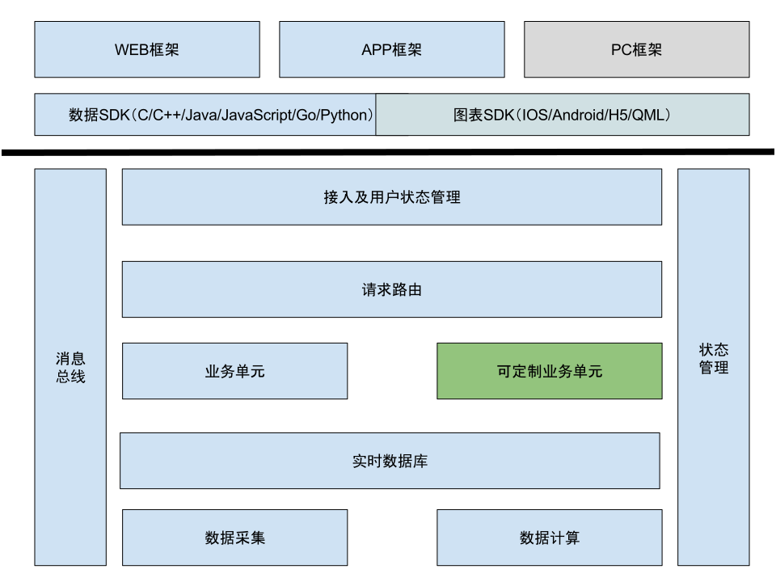

layout: true
class: center, middle, inverse

---

# 大智慧金融信息云
# 整体解决方案

---

layout: true
class: left, top

---

.banner[ 
### 案例1: 某客户在其网站中嵌入三版行情 
]

.content[
.left-column[
#### 客户初始方案

- 从交易所的DBF库开始接入
- 将行情数据写入到SQL数据库中

#### 最终效果

- 开发耗时2个月
- 数据库不能承载实时的数据写入
- 整体页面打开缓慢
- 方案失败，重新寻找解决方案

]

.right-column[
#### 金融云服务方案

- 直接使用行情云服务
- 不再考虑行情服务器的问题

#### 最终效果

- 耗时1周，参考示例，完成嵌入工作
- 主要资源投入在其自身业务逻辑
- 愉快上线
- 来我处洽谈其他服务接入

]
]

---

.banner[ 
### 案例2: 云平台开源APP
]

.content[

项目目标: 开源的行情、分析APP，提供大智慧APP 70% 的功能

主要功能

- andoird/ios 平台支持
- 行情展示: 报价、分时、K线、排行等
- 新闻、公告展示
- F10展示
- 事件推送: 新闻公告推送，自定义事件推送

项目投入:

- 3人总计6人/月
]

---

.banner[
### 案例3: 券商自研APP
]

.content[
.left-column[
#### 自研解决方案

- 资源投入
	- 30~40人总计400~500人/月

- 资源分配
	- 交易所行情接入
	- 行情服务器
	- 新闻、财务、公告接入服务
	- 交易服务及接口
	- APP开发

]

.right-column[
#### 金融云服务的解决方案 

- 资源投入
	- 3~6人总计20~30人/月

- 资源分配
	- 交易服务及接口
	- APP修改定制
]
]

---

.banner[
### 服务内容
]
.content[
云服务方向

- 全市场行情云服务
- 全市场经济数据云服务
- 衍生计算数据云服务
- 全市场相关的新闻资讯云服务
- 模拟交易服务
- 金融数据计算云服务
- 持续增加……

云终端方向

- 覆盖主流平台的开源终端

云管理方向

- 客户CRM
- 消息推送
]

---
.banner[
### 服务目标
]
.content[
立足服务各种金融创新业务

- 中小初创公司
- 券商
- 银行
- 高校
- ……

一站式服务

- 前端（SDK、图形组件、APP框架，网站框架……）
- 后端（行情、资讯、统计、排序、键盘宝……） 
- 外延（消息推送、客户CRM）

尽量减少接入和运营成本

- 丰富的文档示例
- 符合业界规则的接口
- 极致优化的数据传输，为客户省钱
	- 一个股票全天的分时数据仅2K
]

---

.banner[
### 服务特色
]

.content[
省心省力

- 脏活累活由云服务来完成
- 客户专注自己的业务即可

极速达成目标

- 费时费力的由云服务来完成
- 加速产品上线进度

自主可控

- 云服务所提供的是业界标准的、无需定制功能
- 提供各种深度、维度的支持
- 客户的创新不受限制

降低成本

- 成本标准化（沟通成本、数据成本、开发成本……）
- 低廉的使用价格
]

---

.banner[
### 服务计费模式
]

.content[
费用 = 初始费用 + 实际使用流量 x 单位流量价格

初始费用

- 年服务费用

单位流量价格

- 最多不超过 10/GB

优惠方案

- 随用户实际使用量，流量越多，单位流量费用越低
- 预付大于1年，初始费用有相应的折扣
]

---

.banner[
### 终端技术概述
]

.content[
前端框架

- 移动: React Native
- WEB: HTML5
- PC: Qt/QML

选型依据

- **编程语言尽量一致**
- **各平台尽量达到原生效果**
- 尽量降低技术门槛
- 尽量提高代码的复用
]

---

.banner[
### 移动APP简介
]

.content[
主要特点

- 100% 开源，BSD开源许可，业内最宽松的开源许可之一
- 使用 React Native 技术搭建 
	- 具备原生的流畅用户体验
	- android/ios 复用 90% 的代码
	- 开发使用 Javascript 语言
	- 提供多种金融APP相关的组件：图表、新闻等
- 结构定义合理，最少**一个**中高级开发人员就能够完成定制工作
	- LOGO、启动画面定制
	- 导航栏定制
	- 客户功能增加
	- ……
- 默认框架吸收多款APP优点精心设计
- 全面的文档
- 提供系统讲解服务
]

---

.banner[
### Web接入简介
]

.content[

提供标准的行情中心页面模版

- LOGO配色定制
- 功能剪裁

提供数据SDK

- 自行接入

提供绘图组件

- 减少自行接入工作量 
]

---

.banner[
### 云服务技术简介
]

.content[
基础设施 ：阿里金融云
- BGP机房，访问无障碍
- 弹性伸缩，压力再大也不怕
- 采用阿里大并发解决方案

金融信息行业特有的技术实现

- 实时数据库
	- 10万 QPS

- 超高速消息总线
	- 100万 消息/秒

- 优化的数据传输格式
	- 差分算法
	- 精度保持
]
---

.banner[
### 云服务技术简介
]

.content[

同时提供 HTTP 和 WebSocket 访问方式

- HTTP
	- JSON 格式，适用性广
	- 便于集成至各种系统中

- WebSocket
	- Protobuf 格式，升级向前兼容
	- 推送支持
	- 包含各种数据优化算法
]
---

---

.banner[
### 资源链接
]

.content[

- [简介PPT](http://huicloud.github.io)
- [接入文档](https://www.gitbook.com/book/elsejj/dzhyun/details)
- [移动APP框架](https://github.com/huicloud/mobile)
]
